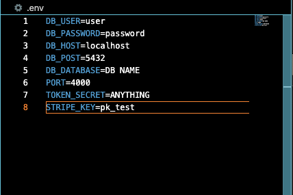

  <h1>Buy My Stuff</h1>
  <strong>Basic e-commerce web app built to test full-stack engineering fundamentals using the PERN stack</strong> 

 

## What is Buy My Stuff??
Buy My Stuff is an e-commerce web app I built during the Codecademy Full-Stack Engineer course. Unlike other projects in the course, this one consists entirely of code I personally wrote (with help from stackoverflow and other sites, of course). Codecademy simply provided the prompt - build an e-commerce web app using a RESTful API - and a very general project outline. The purpose of the site is to test and showcase my capabilities as a full-stack engineer. However, it can easily be implemented as the backbone of a production e-commerce web app.

## Usage
Please follow the following steps to set up the app locally.
 1. Download all files from the Buy My Stuff repository on github.
  
 
 2. Make sure your local [Postgres](https://www.postgresql.org/) server is running.
  
 
 3. Open your favorite Postgres client and create a new database for your e-commerce app. Import bms.sql from the db folder of the BMS repository.
  
 
 4. Open your favorite code editor and create a .env file with the following format: 
 DB_USER=YOUR DATABASE USERNAME
 DB_PASSWORD=YOUR DATABASE PASSWORD
 DB_HOST=localhost (make sure this matches your database)
 DB_POST=5432 (make sure this matches your database)
 DB_DATABASE=YOUR DATABASE NAME
PORT=4000
 TOKEN_SECRET=ANYTHING
 STRIPE_KEY=YOUR STRIPE KEY(see step 9)
  
 
 5. Make sure Node.js is installed and up to date
  
 
 6. Navigate to the BMS directory in your terminal and run npm install to install all dependencies from package.json.
  
 
 7. Run the back-end locally.
  
 
 8. Open a new terminal window or tab and navigate to the view folder of the BMS repository. Run the front-end locally.
  
 
 9. Create a Stripe account and add the secret test key to your .env file. To locate, simply navigate to "API Keys" in the "Developers" tab. Then <strong>switch to test mode</strong>. Lastly, reveal the test key and copy & paste it to your .env file.
  
 
 10. And that's it! You should now see the By My Stuff e-commerce app open in your browser at localhost:3000.
  

### Requirements
The following packages and programs are required for the app to work.
- PostgreSQL - download from the Postgres site [here](https://www.postgresql.org/)
- Node.js v16.18.0+ - download from the Node site [here] (https://nodejs.org/en)

Remember to install all package.json dependencies with npm install (See step 4 in Usage)

## Additional Notes

If you have any questions/concerns or just want to discuss the app, please reach out anytime: bmitchum.dev@gmail.com